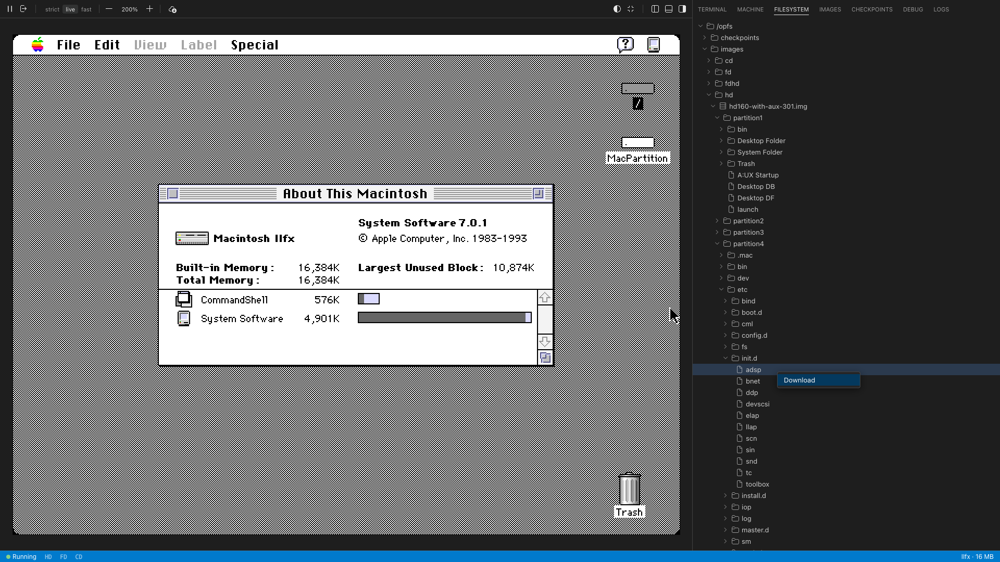
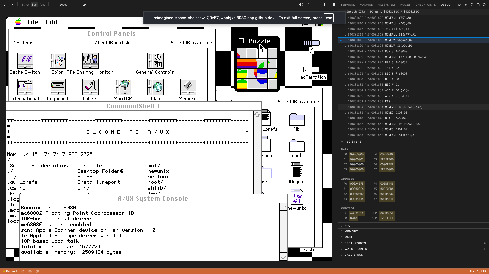
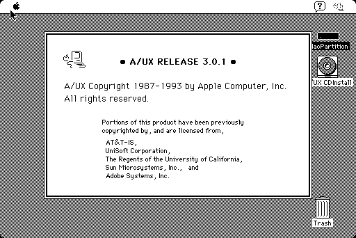
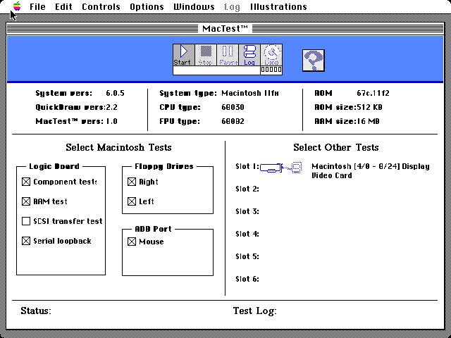
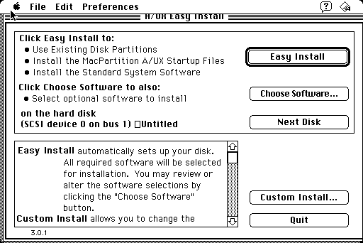
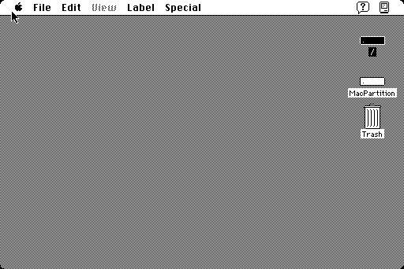
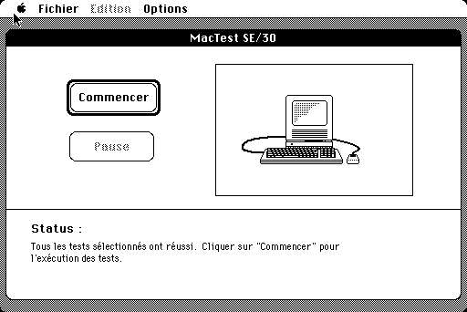
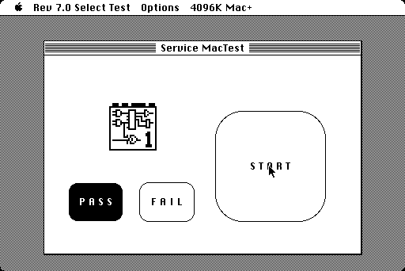
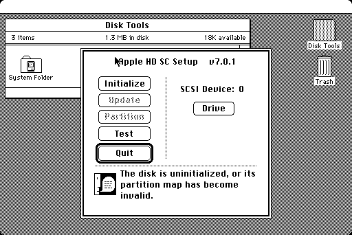

# Gallery

A tour of Granny Smith running real Macintosh software — and the tooling around it. Most software screenshots below are captured by an automated integration test in this repository: the emulator is driven headlessly through the same boot path that ships to the browser, so what you see is what you get. A few show the interactive frontend itself — the integrated debugger and the filesystem browser.

> **[Try Granny Smith yourself →](https://pappadf.github.io/gs-pages/latest/)**

---

## Filesystem Browser

The **Filesystem** panel unifies host and guest storage into a single tree — disk images open up like directories, so you can descend straight from a host folder into the volumes inside an image. The host side covers both **OPFS** (the browser's Origin Private File System) and the in-memory **MemFS**; expanding `hd160-with-aux-301.img` walks the disk image in place, through the **HFS** volume (`MacPartition`, with its System Folder, A/UX Startup, and Trash) and the A/UX **UFS** partitions (`bin`, `dev`, `etc`, `init.d`, …). Any file can be copied straight out of either tree.

---

## Integrated Debugger (IIfx / A/UX)

The full **integrated debugger** attached to a Macintosh IIfx running A/UX. The left half is the live machine — Control Panels, a CommandShell, and the A/UX System Console; the right pane is a live **disassembly view** that tracks the program counter instruction by instruction, a **register file** that highlights the values changed by the last step, and inline **breakpoints**.

---

## Booting A/UX (SE/30)

A full **SE/30 cold boot into A/UX 3.0.1**, captured end to end — from the Happy Mac through the UNIX kernel bring-up to the Finder desktop sitting on top of a System V UNIX userland.

---

## MacTest (Macintosh IIfx)

Apple's **MacTest 1.0** identifying a **Macintosh IIfx** — System 6.0.5, a 68030 CPU with a 68882 FPU, 512 KB ROM, and 16 MB RAM — with the hardware-identification panel rendered in 256 colours (8 bpp on the JMFB display card).

*Test:* [iifx-mactest](tests/integration/iifx-mactest/)

---

## A/UX 3.0.1 Installer (SE/30)

The **A/UX 3.0.1 Installer** dialog, booted from A/UX boot floppy with the installer CD-ROM mounted as the root filesystem. From here the installer lays down a MacPartition, the A/UX startup files, and the standard system software onto a SCSI hard disk.

*Test:* [se30-aux-3](tests/integration/se30-aux-3/)

---

## A/UX 3.0.1 Desktop (SE/30)

The A/UX 3.0.1 **Finder desktop** after a clean boot from a installed HD image. A/UX presents itself as a familiar Mac desktop on top of a System V Release 2 UNIX kernel — `MacPartition` is the HFS volume.

*Test:* [se30-aux3-boot](tests/integration/se30-aux3-boot/)

---

## A/UX 3.0.1 CommandShell (SE/30)

A/UX's **CommandShell** - launches in a regular Mac window, mixing the classic toolbox with a real UNIX userland.

*Test:* [se30-aux3-boot](tests/integration/se30-aux3-boot/)

---

## MacTest (SE/30)

Apple's internal **MacTest SE/30** diagnostic suite reporting *"Tous les tests sélectionnés ont réussi"* — every selected hardware test passed. This exercises the VIA, SCSI, IWM, sound, and logic-board paths against Granny Smith's emulated hardware.

*Test:* [se30-mactest](tests/integration/se30-mactest/)

---

## MacTest (Macintosh Plus)

The classic **MacTest Rev 7.0** running on an emulated 4 MB Macintosh Plus. The full suite — logic board, RAM, video, IWM, sound — completes with a green **PASS**, validating the 68000 core and Plus-era peripheral emulation.

*Test:* [plus-mactest](tests/integration/plus-mactest/)

---

## Apple HD SC Setup (SE/30)

**Apple HD SC Setup v7.0.1** ready to initialize a freshly created blank 80 MB SCSI image.

*Test:* [se30-format-hd](tests/integration/se30-format-hd/)
