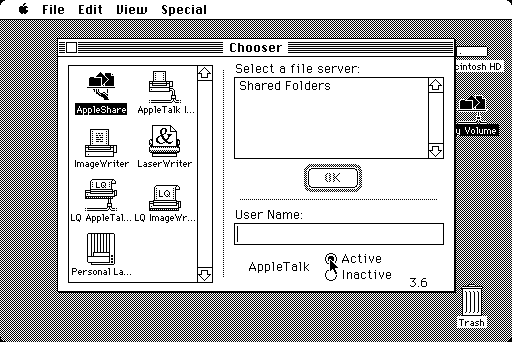

# Granny Smith

[](https://github.com/pappadf/granny-smith/actions/workflows/tests.yml)
[](LICENSE)

> **[Try Granny Smith instantly in your browser!](https://pappadf.github.io/gs-pages/latest/)**

**Granny Smith** is a browser-first 68000 Macintosh emulator.

You can try it out live here: **[Run Granny Smith in browser](https://pappadf.github.io/gs-pages/latest/)**



The guiding principle for this project is to "keep it simple" — simple for everyone to run classic Macintosh software as well as simple to develop and maintain the emulator itself.

## Simple for Users

- **Run in the browser** – no installation needed
- **Continuous background checkpointing** – reload or close the browser without losing your running session
- **Mount disk images by drag-and-drop** – even if they're compressed in `*.sit.hqx` format
- **Access the browser/host filesystem** through a built-in AFP file server

## Simple for Developers

- **Extensive automated testing** – unit tests, headless integration tests, and Playwright end-to-end tests
- **Highly portable C99 core** – no special runtime requirements
- **Simple CPU model** – no advanced JIT compiler or meta tools; we rely on the compiler and modern hardware to make it fast enough
- **Compact and maintainable** – the entire CPU instruction decoder is under 550 lines and all opcode implementations fit in under 1,000 lines
- **Comprehensive documentation** – hardware documentation in Markdown format, easily accessible for both human developers and AI agents
- **AI agent friendly** – repository organized to simplify work for coding agents

## Getting Started

To run Granny Smith you need a Macintosh Plus ROM image and a bootable system disk image. Both are loaded by drag-and-drop in the browser — no other configuration required.

1. **[Open Granny Smith](https://pappadf.github.io/gs-pages/latest/)** in any modern browser
2. Drag a **Macintosh Plus ROM** file onto the emulator window
3. Drag a **bootable disk image** (e.g., a System 6 `.dsk` file) onto the window
4. The emulator boots automatically — your session is saved continuously in the background

Disk images can be raw (`.dsk`, `.img`) or compressed (`.sit.hqx`). The emulator decompresses them on the fly via the bundled [peeler](third-party/peeler) library.

### Running Locally

If you want to build and run Granny Smith locally (e.g., for development or to enable audio via SharedArrayBuffer):

```bash
make run               # Build and start HTTP server on :8080
```

This builds the WebAssembly version and starts a local server with the required COOP/COEP headers for advanced features like audio. See [CONTRIBUTING.md](CONTRIBUTING.md) for detailed build instructions.

## Current Status

### What Works

- All relevant Macintosh Plus hardware fully emulated (no ROM patching)
- Accurate enough timing (MacTest hardware test suite runs without errors)
- Mounting of compressed disk images (e.g., `*.sit.hqx`) via the [peeler](third-party/peeler) library
- Background checkpointing and on-demand checkpointing/restore
- Browser filesystem accessible as an AFP share with authentication and file browsing

### Known Limitations

- LaserWriter emulation incomplete – printer is identified but print jobs don't finish correctly
- AFP file content access not yet implemented (just mounting/browsing)

## Development

The easiest way to get up and running is by creating a GitHub Codespace based on the repository. From the granny-smith code page, click **Code** (the big green button) → **Codespaces** → **Create a Codespace on main**. It will take a minute or two, then you're up and running. To build: `make`. To run: `make run`.

**Build and test instructions**: See [CONTRIBUTING.md](CONTRIBUTING.md)

**Architecture and design docs**: See [docs/ARCHITECTURE.md](docs/ARCHITECTURE.md)

**Coding guidelines**: See [AGENTS.md](AGENTS.md)

| Area | Directory |
|------|-----------|
| Browser frontend | [app/web/](app/web/) |
| CPU core | [src/core/cpu/](src/core/cpu/) |
| Peripherals | [src/core/peripherals/](src/core/peripherals/) |
| Machine definitions | [src/machines/](src/machines/) |
| Hardware documentation | [docs/](docs/) |

## Roadmap

- Finalize LaserWriter emulation and AFP file server
- Add support for OPFS (to replace idbfs) for persistent browser storage
- Add an Electron build target (just placeholder today)
- Add support for 68030-based Macintosh models
- Bootstrap A/UX

## Acknowledgments

- [raddad772](https://github.com/raddad772) for the 68K test suite ([single-step-tests](https://github.com/SingleStepTests/m68000))
- [xterm.js](https://xtermjs.org/) for terminal emulation in the browser
- [JSZip](https://stuk.github.io/jszip/) for ZIP file handling
- [Emscripten](https://emscripten.org/) for the WebAssembly toolchain

## Trademarks

All trademarks referenced in this project are the property of their respective owners and are used for identification purposes only. This project does not claim any endorsement by or affiliation with the trademark holders.

## License

[MIT](LICENSE)


