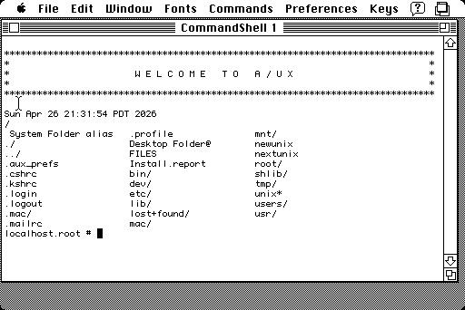

# Granny Smith

**Granny Smith** is a browser-first 68000/68030 Macintosh emulator capable of running classic Mac OS (System 2 through System 7) and A/UX.

> **See it →** &nbsp;[Screenshot gallery of A/UX, MacTest, and more](GALLERY.md)
> _Captured by automated integration tests — what you see is what the emulator actually produces._

> **Try it →** &nbsp;[Open Granny Smith in your browser](https://pappadf.github.io/gs-pages/latest/)
> _Best experience on Chromium-based browsers (Chrome, Edge). Safari and Firefox have known issues — see below._

The guiding principle of this project is **"keep it simple"** — simple for users to run classic Macintosh software, and simple to develop and maintain.

## Simple for Users

- **Runs in the browser** — no installation required
- **Continuous background checkpointing** — close or reload the tab without losing your session
- **Drag-and-drop disk images** — even compressed `*.sit.hqx` archives are handled transparently
- **Built-in AFP file server** — bridge the browser/host filesystem into the guest OS

## Simple for Developers

- **Extensive automated testing** — unit tests, headless integration tests, and Playwright end-to-end tests
- **Highly portable C99 core** — no special runtime requirements
- **Simple CPU model** — no JIT compiler or meta tools; we rely on the compiler and modern hardware for performance
- **Compact and maintainable** — the entire CPU instruction decoder is under 550 lines; the 68000 opcode implementations fit in under 1,000 lines (68030 support excluded)
- **Comprehensive documentation** — hardware documentation in Markdown, accessible to both human developers and AI agents
- **AI-agent friendly** — repository organized to simplify work for coding agents

## Getting Started

You will need a Macintosh ROM image and a bootable system disk image.

1. **[Open Granny Smith](https://pappadf.github.io/gs-pages/latest/)** in any modern browser
2. On first launch, upload a **Macintosh Plus, SE/30, or compatible ROM** — it is persisted in the browser's OPFS storage, so you only need to do this once
3. In the **Machine Configuration** dialog, pick a model (Plus, SE/30, …), choose RAM, and attach disk images to the floppy / SCSI / CD slots
4. Click **Boot** — your session is checkpointed continuously in the background, so closing or reloading the tab won't lose state
5. Once running, you can drag-and-drop additional disk images directly onto the screen to insert them at runtime

Disk images can be raw (`.dsk`, `.img`), compressed (`.sit.hqx`), or packaged in `.zip` archives. They are decompressed transparently via the bundled [peeler](third-party/peeler) library.

For build, test, and contribution instructions, see [CONTRIBUTING.md](CONTRIBUTING.md). Architecture and design docs live in [docs/ARCHITECTURE.md](docs/ARCHITECTURE.md), and coding guidelines in [AGENTS.md](AGENTS.md).

## Current Status

### What Works

- Macintosh Plus (68000) and SE/30 (68030) fully emulated, with no ROM patching
- Machine configuration dialog with model selection and RAM sizing
- Accurate-enough timing — the MacTest hardware test suite passes on both models
- Booting **classic Mac OS** — verified end-to-end across System 2 through System 7
- Booting **A/UX 3.0.1**
- Installing **A/UX 3.0.1** from floppy + CD
- Mounting of compressed disk images (`*.sit.hqx`, `*.zip`) via the [peeler](third-party/peeler) library
- Background checkpointing and on-demand checkpoint/restore
- Browser filesystem exposed as an AFP share with authentication, browsing, and file read/write

### Known Limitations

- **Safari** — known rendering and audio issues; not currently supported
- **Firefox** — works partially; some compatibility problems remain
- **A/UX runtime** — occasional residual errors during sessions
- **LaserWriter** — printer is identified, but print jobs don't complete correctly
- **AFP** — file content access not yet implemented (mounting and browsing only)

## Acknowledgments

- [raddad772](https://github.com/raddad772) for the 68K test suite ([single-step-tests](https://github.com/SingleStepTests/m68000))
- [xterm.js](https://xtermjs.org/) for terminal emulation in the browser
- [JSZip](https://stuk.github.io/jszip/) for ZIP file handling
- [Emscripten](https://emscripten.org/) for the WebAssembly toolchain

## Trademarks

All trademarks referenced in this project are the property of their respective owners and are used for identification purposes only. This project does not claim any endorsement by or affiliation with the trademark holders.

## License

[MIT](LICENSE)
