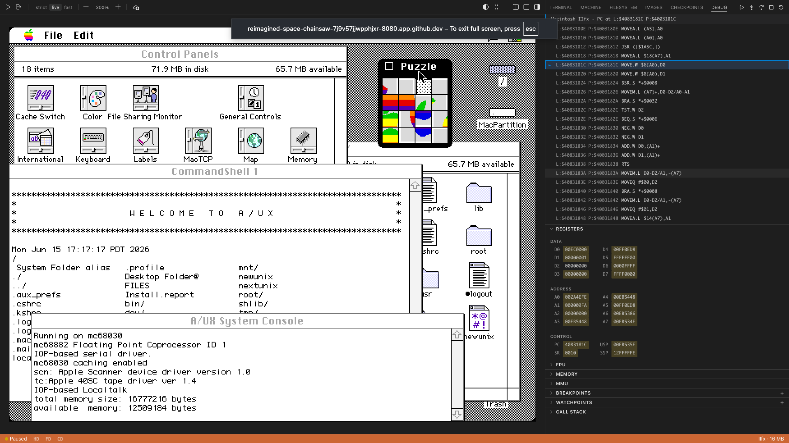

# Granny Smith

**Granny Smith** is a browser-first Macintosh and Apple Lisa emulator spanning three CPU generations, from the 68000 Lisa 2 and Macintosh Plus to the 68040 Quadra towers and AV machines. It runs Mac OS (System 2.0 through System 7.6) and A/UX 3.0.1 on the Macintosh, and the Lisa Office System, MacWorks XL, and Xenix on the Lisa 2 / Macintosh XL.

> **See it:** [Screenshot gallery of A/UX, MacTest, and more](GALLERY.md) from the test system

> **Try it:** [Run Granny Smith in your browser](https://pappadf.github.io/gs-pages/latest/)
> Use Chromium browser (Safari and Firefox have known issues)

## Emulated Machines

Each machine is modeled faithfully: the original ROMs run unpatched, and all on-board devices the software touches are emulated in enough detail that even timing-sensitive, close-to-hardware diagnostics like Apple's MacTest suites pass.

- **Apple Lisa 2 and Macintosh XL**
  - 68000 with Apple's custom MMU
  - COPS keyboard/mouse/clock/power controller, 6504 floppy controller
  - Sony floppy, ProFile HD, VIAs, SCC serial, video
  - Tested with Lisa Office System 3.1, Xenix 3.0, MacWorks XL
- **Macintosh Plus**
  - 68000
  - RTC, keyboard, mouse, IWM, Sony floppy, 5380 SCSI, PWM sound, VIA, SCC serial, video
  - Tested with System 2 through System 7.1
- **Macintosh SE/30, IIx, and IIcx** (the 68030 "GLUE" generation)
  - 68030 with on-chip PMMU + 68882 FPU
  - RTC, ADB, SWIM floppy, 5380 SCSI, ASC sound, VIAs, SCC serial, NuBus or built-in video
  - Tested with System 6.0.3 through 7.5, and A/UX 3.0.1
- **Macintosh IIfx**
  - 68030 with on-chip PMMU + 68882 FPU
  - OSS interrupt controller, FMC memory controller, 65C02 IOPs (SCC, SWIM/ADB), SCSI DMA engine
  - RTC, ADB, SWIM floppy, 5380 SCSI, ASC sound, VIA, SCC serial, NuBus
  - Tested with System 6.0.8 through 7.6 and A/UX 3.0.1
- **Macintosh IIci and IIsi** (the 68030 MDU generation)
  - 68030 with on-chip PMMU + 68882 FPU
  - RBV (VIA2 replacement and built-in video), Egret system manager on the IIsi
  - RTC, ADB, SWIM floppy, 5380 SCSI, ASC sound, VIA, SCC serial, NuBus, video
  - Tested with System 6.0.8 through 7.6
- **Macintosh Quadra 700, 900, and 950** (the 68040 MCU generation)
  - 68040 with on-chip MMU and FPU
  - MCU memory controller, DAFB video controller, Caboose system manager and two IOPs on the 900/950
  - RTC, ADB, SWIM floppy, 53C96 SCSI, EASC sound, SONIC Ethernet, VIAs, SCC serial, NuBus, video
  - Tested with System 7.1 through 7.6
- **Macintosh Quadra 840AV and Centris 660AV** (the 68040 AV generation)
  - 68040 with on-chip MMU and FPU
  - YMCA memory controller, PSC (interrupt controller and DMA), Cuda system manager, CIVIC video
  - RTC, ADB, New Age floppy controller, 53C96 SCSI, MACE Ethernet, VIA, SCC serial, CIVIC video
  - Tested with System 7.1

## Emulated Display Cards

NuBus display cards can be seated in any machine with free slots, including as a second display next to built-in video:

- **Apple Macintosh Display Card 8•24** - the standard "JMFB" card, up to 24-bit color
- **Apple Macintosh Display Card 24AC** - 4 MB VRAM, 1-32 bpp, including its hardware QuickDraw fill/copy accelerator
- **Apple Macintosh Display Card 8•24 GC** - the RISC-accelerated "GC" card; QuickDraw acceleration is emulated at the graphics-processor RPC level (and, authentically, its INIT declines to install on a 68040)
- Each card runs either from a dump of its **real declaration ROM** or from a **runtime-generated generic declaration ROM**, so no ROM dump is required; the generic ROM can also synthesize custom resolutions (e.g. 800×600)

## Project Principles

Two principles guide the project: **model the hardware faithfully**, and **keep it simple**. That may sound like a contradiction, since faithful hardware emulation is rarely simple, but we try to make both work.

Fidelity means compatibility is earned by behaving like the real machine, never by patching around differences. Machines boot their original, unpatched ROMs, and every on-board device the software touches is modeled. Chip behaviour is pinned against Apple documentation, chip datasheets, Apple's own system software sources, and the machines' own diagnostics, and CI boots every machine and matches screens and boot chimes against golden references.

For users, simplicity means the emulator runs in the browser with no installation, sessions are checkpointed continuously in the background so closing or reloading the tab loses nothing, disk images can be dragged straight onto the screen (compressed `*.sit.hqx` archives included), and a built-in AFP file server bridges the browser/host filesystem into the guest OS.

For developers, it means a highly portable C99 core with no special runtime requirements and no JIT or code generators: a ~550-line shared instruction decoder and one compact opcode header serve all three CPU generations, relying on the compiler and modern hardware for performance. Extensive automated tests (unit, headless integration, and Playwright end-to-end) keep it honest, and the hardware documentation is written in Markdown so it serves human developers and AI coding agents alike.

## Getting Started

You will need a ROM image and a bootable system disk image for the machine you want to run.

1. **[Open Granny Smith](https://pappadf.github.io/gs-pages/latest/)** in any modern browser
2. On first launch, upload a ROM for your chosen model (anything from the Macintosh Plus to the Quadra 840AV, or a Lisa); it is persisted in the browser's OPFS storage, so you only need to do this once
3. In the **Machine Configuration** dialog, pick a model, choose RAM, and attach disk images to the floppy / SCSI / CD slots (and display cards to NuBus slots)
4. Click **Boot** - your session is checkpointed continuously in the background, so closing or reloading the tab won't lose state
5. Once running, you can drag-and-drop additional disk images directly onto the screen to insert them at runtime

Disk images can be raw (`.dsk`, `.img`), compressed (`.sit.hqx`), or packaged in `.zip` archives. They are decompressed transparently via the in-tree [peeler](src/peeler) library.

For build, test, and contribution instructions, see [CONTRIBUTING.md](CONTRIBUTING.md). Architecture and design docs live in [docs/guide/ARCHITECTURE.md](docs/guide/ARCHITECTURE.md), and coding guidelines in [AGENTS.md](AGENTS.md).

## Known Limitations

- **Safari** - known rendering and audio issues; not currently supported
- **Firefox** - works partially; some compatibility problems remain
- **Ethernet** - the Quadras' SONIC and the AV machines' MACE controllers are modeled at the register/self-test level but are not bridged to a network; networking is AppleTalk over LocalTalk (serial) only
- **Sound input** - not modeled on any machine; the Quadras' EASC currently runs as an ASC-compatible core, and the AV machines' Singer/AWACS sound is not modeled at all
- **AV floppy** - the 840AV/660AV New Age controller reports "no drive", so those two machines boot from SCSI only
- **AV NuBus** - the 840AV's slots C/D/E and the 660AV's adapter slot are decoded but cannot be populated with the display cards above
- **LaserWriter** - printer is identified, but print jobs don't complete correctly
- **AFP** - file content access not yet implemented (mounting and browsing only)

## Acknowledgments

- [raddad772](https://github.com/raddad772) for the 68K test suite ([single-step-tests](https://github.com/SingleStepTests/m68000))
- [xterm.js](https://xtermjs.org/) for terminal emulation in the browser
- [JSZip](https://stuk.github.io/jszip/) for ZIP file handling
- [Emscripten](https://emscripten.org/) for the WebAssembly toolchain

## Trademarks

All trademarks referenced in this project are the property of their respective owners and are used for identification purposes only. This project does not claim any endorsement by or affiliation with the trademark holders.

## License

[MIT](LICENSE)
