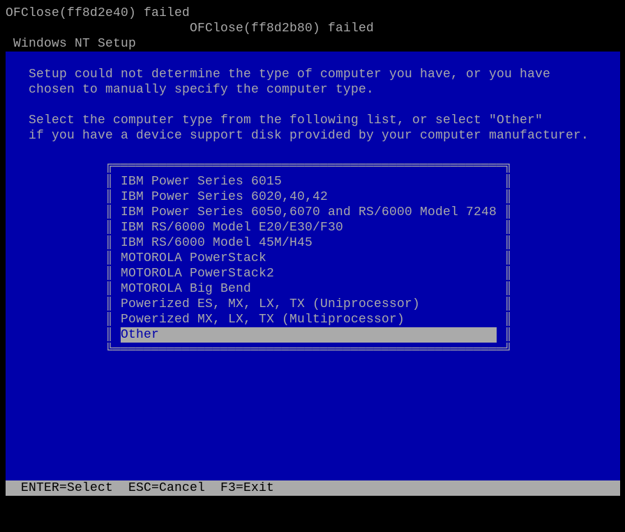

# Windows NT 4.0 Setup on the emulated Apple Network Server: through the veneer to the HAL question

*Investigation log, 2026-09-05. Branch `ppc-le-mode-and-bandit-lane-reversal` (PR #135).*

The TinkerDifferent thread [Apple Network Server MacOS-based ROMs found](https://tinkerdifferent.com/threads/apple-network-server-macos-based-roms-found.4756/)
has been trying to boot Windows NT 4.0 for PowerPC on the Apple Network Server 500/700
with the 2.26NT Open Firmware ROM. On real hardware the furthest point reached (post 49785)
is the *Windows NT Setup* banner followed by

```
The file multi(0)scsi(0)cdrom(0)fdisk(0)partition(1) is corrupted.
Press any key to continue.
```

Granny Smith, with the 604 little-endian mode and Bandit byte-lane reversal from PR #135,
reproduces that screen and gets past it. Windows NT Setup now stops at its computer-type
menu — the point where the missing Apple Network Server HAL is what stands in the way:



This note records what each wall was and the exact recipe, so that it can be repeated
on the emulator or on a real machine. Everything here was worked out with the veneer's
and SETUPLDR's own symbol tables (both ship as bare COFF images with their COFF symbol
tables intact) and the veneer's built-in debug trace; nothing needed emulator changes
beyond PR #135.

## 1. Starting point: the thread's transcript

Post 49785 is a complete Open Firmware transcript: `setenv little-endian? true`, reboot,
read `VENEER.EXE` (the FirmWorks/Microsoft Open Firmware→ARC veneer from the NT 4.0 CD's
`\PPC\`) off a SCSI disk with `read-blocks`, lay it out with the ROM's `pe-loader`
`init-program`, poke four patches (`51E3C`/`514E0`: `nop` two `claim` calls that fail;
`5CD30`: replace the default `\os\winnt\osloader.exe` with `\PPC\SETUPLDR`; `53DB0`), then
`go`. Replayed in the emulator it ends, as PR #135 recorded, with

```
Booting from 'device-tree(0)partition(1)\PPC\SETUPLDR'
VrOpen returned d
```

## 2. Wall 1: `VrOpen returned d` — an empty `bootpath`

`d` is ARC `ENODEV`. The veneer's `find_boot_dev` reads `/chosen` `bootpath`. Loading the
veneer by hand with `read-blocks` never sets it (only the firmware's `load`/`boot` do, in
`$load`), so `finddevice("")` returns the root node, whose ARC name is the Open Firmware
root's `name`, `device-tree`; `VrOpen` then cannot find a `device-tree(0)` component under
its own ARC root. Fix, at the `0 >` prompt before `go`:

```
" /bandit/53c825@11/sd@0,0" encode-string " bootpath" _chosen (property)
```

(`dev /chosen … property` did **not** take; the internal `(property)` with the `_chosen`
phandle did. Check with `dev /chosen .properties`.) The veneer now derives
`multi(0)scsi(0)cdrom(0)fdisk(0)partition(1)\PPC\SETUPLDR`, opens it, relocates
SETUPLDR's six sections and jumps to it — and SETUPLDR prints the real machine's message.
On a real machine booted with `boot` from the CD, `bootpath` is set by the firmware itself.

## 3. Wall 2: "partition(1) is corrupted" — two causes, both in the veneer's path

**The message comes from SETUPLDR's `BlGenerateDeviceNames`**, caught with breakpoints on
`SlFriendlyError`: `SlFriendlyError(7 = EINVAL, "multi(0)scsi(0)cdrom(0)fdisk(0)partition(1)", setup.c line 416)`.
That routine parses the ARC name lexically — adapters (`multi`, `scsi`), then a controller:
`disk` must be followed by `rdisk`/`fdisk` and then `partition`; `cdrom` must be followed by
`fdisk` and then **the end of the name**. One more token is EINVAL, which `SlFriendlyError`
renders as "The file %s is corrupted". The veneer's `find_boot_dev` appends `partition(1)`
to every boot path — right for a hard disk, wrong for a CD-ROM. Same veneer and SETUPLDR
on the real ANS 700, so this is the hardware wall too, independent of the firmware.

**Behind it, Apple's `disk-label` does not give raw sector access for a partition
argument.** SETUPLDR opens the boot device itself (`VrOpen` appends `:0` when a path has
no partition and no file) and probes it with its own FAT/NTFS/CDFS recognizers: reads of
0x62 bytes at 0, 512 at 0x2000, 528 at 0, 2048 at 0x8000 (the ISO volume descriptor).
Apple's `disk-label` `open`, given any non-empty argument (`0`, `1`, …) with no file name,
detects `CD001` and interposes `iso-9660-files`, whose `open` with no path leaves the
instance on the ISO **root directory** as a pseudo-file (428 bytes on this CD; its `seek`
does not touch `fileposn`, its `read` clamps to `filesize`). The four reads return 98,
330, 0 and 0 bytes and the volume descriptor is never seen. Only an **empty** argument
makes `disk-label` return the raw device, whose `read`/`seek` go through the deblocker
and work at any byte offset.

**Both are fixed by two bytes in `VENEER.EXE`** (image base `0x50000`; file offset =
image − `0x50000` + `0x200`):

| image | file | `.rdata` string | patch | effect |
|---|---|---|---|---|
| `0x5D0C0` | `0xD2C0` | `"partition(1)"` | first byte → `00` | boot name becomes `multi(0)scsi(0)cdrom(0)fdisk(0)\PPC\SETUPLDR` |
| `0x5E168` | `0xE368` | `":0"` | first byte → `00` | the bare-device open passes an empty Open Firmware argument → raw sector access |

At the prompt, with the image laid out (the firmware itself runs little-endian here, so
`c!` takes the program's address):

```
00 5D0C0 c!
00 5E168 c!
```

## 4. Result

```
Booting from 'multi(0)scsi(0)cdrom(0)fdisk(0)\PPC\SETUPLDR'
 Windows NT Setup
 Setup is loading files (Windows NT Executive)...
 Setup could not determine the type of computer you have, or you have
 chosen to manually specify the computer type.
   IBM Power Series 6015 / 6020,40,42 / 6050,6070 and RS/6000 Model 7248
   IBM RS/6000 Model E20/E30/F30 / 45M/H45
   MOTOROLA PowerStack / PowerStack2 / Big Bend
   Powerized ES, MX, LX, TX (Uniprocessor) / (Multiprocessor)
   Other
```

SETUPLDR mounted the CD with its own CDFS over raw ARC reads, parsed the 126 KB
`TXTSETUP.SIF`, and read `\PPC\NTKRNLMP.EXE` in full (84 SCSI READ commands covering
its 666 blocks) before asking. The kernel is in memory but nothing of NT executes: the
kernel imports everything hardware-related from `HAL.DLL`, the loader binds those imports
only after a HAL is chosen, and no HAL on the CD is for an Apple machine. Control is in
SETUPLDR's menu loop, polling the ARC console for a key. That is the wall this exercise
was aiming for.

Full recipe, in order, on the emulator (`ans500`, 64 MB, ROM 2.26NT, NT 4.0 OEM CD on
`/bandit/53c825@11/sd@0,0`, the veneer on a disk at `/bandit/53c825@12/sd@0,0`):

1. `setenv little-endian? true`, `setenv real-mode? false`, `setenv real-base 3F00000`,
   `setenv load-base 3E00000`, `reset-all`.
2. The transcript's `read-blocks` / `init-program` / four pokes from post 49785.
3. `bootpath` as in §2.
4. The two `c!` from §3.
5. `go`.

## 5. Things that were *not* the problem

- **The ISO-9660 "reads past 16 KB" defect** noted in PR #135 is real but is the
  firmware's own `deblocker`/`iso-9660-files` interplay (the deblocker is left at the
  absolute extent and `read-blocks` adds the extent again once `open-ok?` is set); the
  firmware's `$load` never seeks, so a bare `load` of a large ISO file is wrong on real
  hardware too. The veneer seeks before every read and never hits it, and SETUPLDR
  reads raw sectors.
- **The emulator.** Every wall was veneer or firmware behaviour; the little-endian CPU
  mode and Bandit lane reversal carried the veneer, the firmware's client interface,
  SETUPLDR's CDFS and INF parser and a full kernel image load without a fault.

## 6. What next

- Pick a shipped PReP HAL (e.g. PowerStack) and watch where its first hardware access
  faults — the first concrete requirement list for an Apple Network Server HAL.
- The nearest existing code is MCJack123's [maciNTosh-bandit](https://github.com/MCJack123/maciNTosh-bandit)
  (NT on Old World Bandit/Hammerhead/Grand Central Power Macs), which lacks a PCI SCSI
  driver — the Network Server's only disk path.

Sources: thread posts 43745 (joevt's detokenized 2.26NT Open Firmware source), 49404,
49460, 49785, 49786; the veneer's and SETUPLDR's embedded COFF symbol tables
(`D:\nt\private\ntos\boot\veneer\vr*.c`, `D:\nt\private\ntos\boot\setup\setup.c`).
