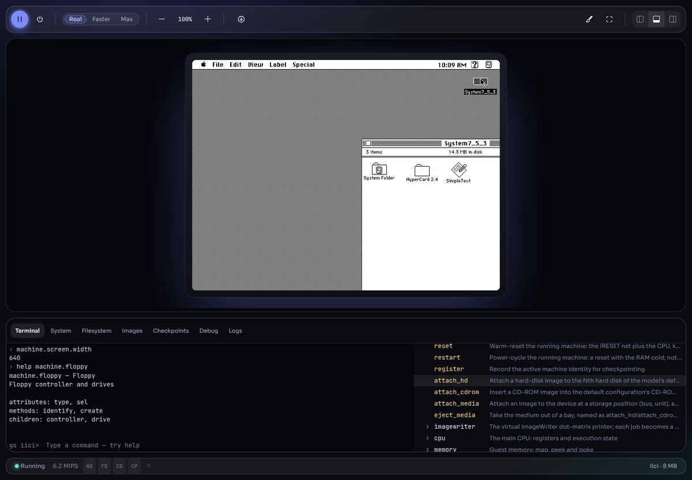

# Using Granny Smith

Granny Smith is a Macintosh and Lisa emulator that runs in your web browser.
It emulates machines from the Lisa 2 and the Macintosh Plus up to the Power
Macintosh G3 and the Apple Network Server, boots their original system
software from disk images, and keeps your ROMs, disks and saved machines in
the browser's own storage between visits.

These pages are for people *using* the emulator. You do not need the source
code, a build, or any developer tools — only a browser, a ROM image and some
disk images.

## 1. Start here

| Page | What it covers |
|---|---|
| [Getting started](getting-started.md) | What you need, your first machine in three ways, the screen at a glance |
| [Supported machines](machines.md) | Every model, the ROM it needs, its memory, video, drives and slots, and the system software known to run on it |

## 2. Everyday use

| Page | What it covers |
|---|---|
| [Creating a machine](new-machine.md) | The New Machine dialog, option by option: memory, addressing, monitors, cards, drives, startup disk |
| [The interface](interface.md) | Toolbar, display, status bar, panels, appearance and full screen |
| [Mouse and keyboard](mouse-and-keyboard.md) | Capturing the mouse, the key map, Caps Lock, Lisa keys |
| [Disks and images](disks-and-images.md) | Image formats, loading and creating disks, the Images and Filesystem panels, compact storage |
| [Saving and resuming](saving-and-resuming.md) | Automatic checkpoints, resuming after a reload, saved-state files |
| [Sharing files with the Mac](sharing-files.md) | Getting files into and out of the emulated Mac |
| [Printing](printing.md) | The ImageWriter and the LaserWriter; printed pages as PDF |
| [Sound, camera and 3D](sound-and-video.md) | Sound output, microphone and camera on the AV Macs, speech recognition, the Voodoo2 3D card |

## 3. Links and power use

| Page | What it covers |
|---|---|
| [URL parameters](url-parameters.md) | Booting a machine straight from a link: every parameter, with examples |
| [The terminal](terminal.md) | The built-in command shell for everyday tasks |
| [Debugger and logs](debugger.md) | Pausing, stepping, breakpoints, memory, and the log panel |
| [Troubleshooting](troubleshooting.md) | Symptom → fix, and current limitations |

## 4. About this documentation

Every page describes what you see in the browser and must stay true without
a source checkout. How the emulator is built is documented separately for
developers, under [`../guide/`](../guide/) and [`../internals/`](../internals/).
