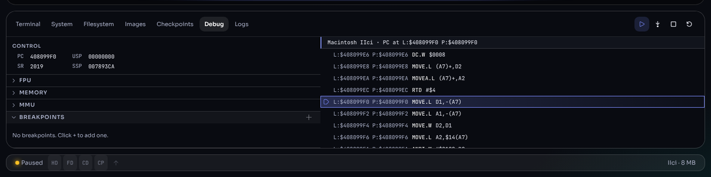

# Debugger and logs

For the curious and for software developers: Granny Smith can stop the
emulated processor, show what it is doing, and step through it one
instruction at a time. The **Logs** panel shows what the emulated hardware
is doing behind the scenes.

## 1. The Debug panel



The panel's header has the debug controls:

| Control | Does |
|---|---|
| **Pause** / **Continue** | Stop the processor, or let it run on |
| **Step Into** | Execute one instruction, entering subroutines and traps |
| **Stop** | Stop the machine |
| **Restart** | Restart the machine |

The right side lists the **disassembly** around the current instruction,
which is highlighted; the header line shows the model and the program
counter (logical and physical address). The disassembly appears only while
the machine is paused.

## 2. Sections

The left side has collapsible sections:

| Section | Shows |
|---|---|
| **Registers** (Control) | The processor registers: PC, status register, stack pointers, data and address registers on 68K; the PowerPC registers on Power Macs |
| **FPU** | The floating-point registers, on machines that have an FPU |
| **Memory** | A hex and text view of memory at an address you enter, by logical or physical address |
| **MMU** | On machines with a memory-management unit: its **State**, the address **Map**, the translation **Descriptors**, and **Translate** (look up one address), for supervisor or user mode |
| **Breakpoints** | Stop when the processor reaches an address. Click **+** to add one |
| **Watchpoints** | Stop when memory at an address is read or written. Click **+** to add one |
| **Call stack** | The chain of subroutine calls leading to the current instruction |

## 3. From the terminal

The same functions are available as commands, with more options:

```
stop                      pause the machine
step                      run one instruction (step 100: a hundred)
disasm                    disassemble from the current instruction
run                       continue
```

`help debug` lists breakpoints, logpoints (print a message when an address
is reached, without stopping), watchpoints and memory search.

## 4. The Logs panel

The emulator can report in detail what each part of the emulated hardware
is doing — the SCSI bus, the floppy controller, the video, the network,
and so on. All categories are quiet until you turn one up.

1. Click **Levels** and set a level for the category you are interested in
   (0 is off; higher numbers report more detail). Or type
   `log.set <category> <level>` in the terminal, for example
   `log.set scsi 2`.
2. Messages appear in the panel as they happen. The footer counts lines and
   categories.
3. **autoscroll** keeps the newest line in view; **Clear** empties the
   panel; **Download** saves the log as a text file.

High levels on busy categories (the processor, memory) produce a great
deal of output and slow the machine down; turn them off again with level 0.
