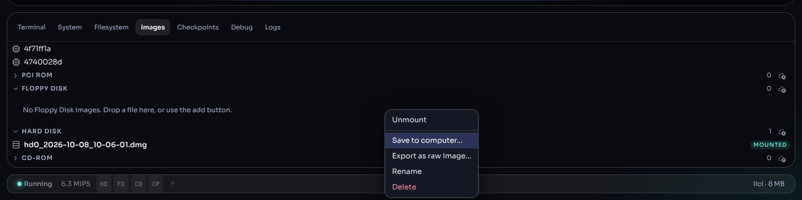
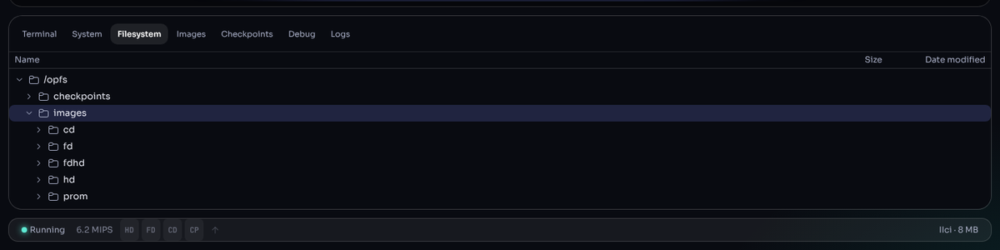

# Disks and images

Everything the emulated Mac reads — its ROM, floppies, hard disks and CDs —
comes from image files. This page explains which files work, how to load
them, and how to manage the ones you have stored.

## 1. What you can load

| Kind | Typical files | Notes |
|---|---|---|
| ROM | the ROM chip's contents, any name | Recognised by its checksum; see [Supported machines](machines.md) §1 |
| Video ROM (VROM) | a NuBus display card's declaration ROM | Optional: cards work with a substitute without it |
| PCI ROM | a PCI card's option ROM | Needed by the Apple Accelerated PCI Graphics Card |
| Floppy disk | 400K, 800K and 1.4 MB images: raw `.dsk`/`.img`/`.image`, Disk Copy 4.2 | Recognised by size |
| Hard disk | raw `.img`/`.hda`/`.dsk`, Disk Copy 6 (NDIF), `.dmg` (UDIF) | Partitioned disks, and single-volume (HFS) images without a partition map, both boot |
| CD-ROM | `.iso`, `.toast`, `.cdr`, `.dmg` | ISO 9660, HFS or partitioned |
| Lisa ProFile | raw ProFile images; Disk Copy 4.2 ProFile images with tag bytes | For the Lisa and Macintosh XL hard disk |

Wrappers and archives are opened for you: **zip**, **gzip** (`.gz`),
**StuffIt** (`.sit`, `.sea`), **Compact Pro** (`.cpt`), **BinHex**
(`.hqx`), **MacBinary** (`.bin`) and **tar**. A disk inside one of them is
found and taken out automatically. (7-Zip archives are not supported:
extract them on your computer first.)

### 1.1 How a file is recognised

The file name does not matter; the contents do. When you drop or load a
file without saying what it is, Granny Smith tries in turn: ROM, video
ROM, PCI ROM, floppy (exact floppy sizes only), CD-ROM (a CD file system or
partition map), an archive (looks inside), and finally hard disk — any
other non-empty image.

## 2. Loading images

| Where | How |
|---|---|
| New Machine dialog | A drive's menu → **Load image...** ([Creating a machine](new-machine.md)) |
| Home screen | **Load ROM...** (several files at once) |
| The display | Drop files on the screen: ROMs are stored; floppies and CDs go into the running machine's drives |
| Images panel | The add button of a section, or drop a file on the section (checked strictly against that kind) |
| Filesystem panel | Drop files into a folder (§5) |
| A link | `rom=`, `fd0=`, `hd0=`, `cd=` … ([URL parameters](url-parameters.md)) |

Every image you load is stored in the browser (under `/opfs/images/`), so
next time it is already in the menus.

### 2.1 Compact storage

The browser counts a stored file's full size against the site's storage
allowance, including empty space. So hard-disk and CD images larger than
16 MB are stored **compressed, as `.dmg` (UDIF) files**: empty space costs
nothing and the rest is compressed — a 2 GB disk with a small system on it
takes tens of MB. They are converted while they load (a zip or gzip is
unpacked on the way), so the full-size disk never has to fit in storage.
A `System 7.5.3.img` you add is stored as `System_7.5.3.dmg`.

A `.dmg` you save to your computer opens in macOS (`hdiutil`), 7-Zip and
`dmg2img`; **Export as raw image…** gives a plain image instead.

## 3. Blank disks

- **Floppy:** **Create blank image...** in a floppy menu — 800K or 1.4 MB.
- **Hard disk:** **Create blank image...** in a hard-disk menu, sized as an
  Apple drive from 20 MB (HD20SC) to 1 GB (HD1000SC); or `hd0=blank:…` in
  a link for any size up to 2 GB.

A blank disk is unformatted. Initialise it from the Mac — the Finder offers
to initialise a blank floppy; a hard disk is initialised with Apple HD SC
Setup, Drive Setup or the system installer.

## 4. The Images panel

The **Images** tab lists what you have stored, in sections: **ROM**,
**VROM**, **PCI ROM**, **Floppy Disk**, **Hard Disk** and **CD-ROM**. ROMs
are listed by checksum. A disk the running machine is using is marked
(**INSERTED · DRIVE 1**, **MOUNTED**).

Right-click an image:

| Action | What it does |
|---|---|
| **Insert** / **Eject** | Put a floppy or CD into the running machine's drive, or take it out. With several drives, choose which ("Insert into …"). |
| **Mount** / **Unmount** | Attach a hard-disk image to the running machine, or detach it. |
| **Save to computer…** | Download the stored file. |
| **Export as raw image…** | Download a `.dmg` as a plain, uncompressed image. |
| **Compact (store as .dmg)** | Convert a large raw hard-disk or CD image to compact storage and remove the raw file. Saved machines that use the raw file will no longer find it. |
| **Rename** | Rename the stored file. |
| **Delete** | Remove it (asks first). |

## 5. The Filesystem panel

The **Filesystem** tab shows the browser storage the emulator uses:

| Folder | Holds |
|---|---|
| `/opfs/images/rom`, `vrom`, `prom`, `fd`, `hd`, `cd` | Your stored images, by kind |
| `/opfs/checkpoints` | Saved machines ([Saving and resuming](saving-and-resuming.md)) |
| `/opfs/shared` | The folder shared with the Mac over AppleTalk ([Sharing files](sharing-files.md)) |
| `/opfs/upload` | Yours to use for anything |

What you can do:

- **Browse inside** disk images and archives: expand them like folders to
  see the Mac files on an HFS disk, the members of a StuffIt archive, and
  so on (read-only).
- **Right-click** an item: **Rename**, **Save to computer…** (several
  selected: **Save files…**), **Export as raw image…**, **Unpack** (extract
  an archive into a folder next to it), **Delete**.
- Inside an image or archive, a disk image found there can be put straight
  into the machine: **Insert into floppy drive**, **Attach as hard disk**,
  **Insert into CD-ROM drive**.
- **Drop files** from your computer onto a folder to copy them in. Drag
  items within the panel to move them; drag them out of an image to copy.

## 6. Your stored images are never changed

The Mac never writes to a stored image. What it writes — new files,
installed software, a formatted blank disk — is kept with that machine,
alongside its saved state. This means:

- Several machines can use the same image without affecting each other.
- Starting a *new* machine with an image always starts from the image as
  you loaded it. To continue with your changes, resume the machine
  ([Saving and resuming](saving-and-resuming.md)).
- **Save to computer…** on an image gives the original file, not the Mac's
  changes. To take your work out of the Mac, copy it to the shared folder
  ([Sharing files](sharing-files.md)), or save the whole machine with
  **Save State**.

## 7. Storage space

The first time you import a large image, the page asks the browser to keep
its data permanently, so it is not cleared when the disk fills up. If an
import does not fit, a notice says how much space is free ("Not enough
browser storage for …"). Free space by deleting images and checkpoints you
no longer need (Images and Checkpoints panels).

Clearing the browser's site data for the emulator's page removes
everything it has stored — ROMs, images and saved machines.
