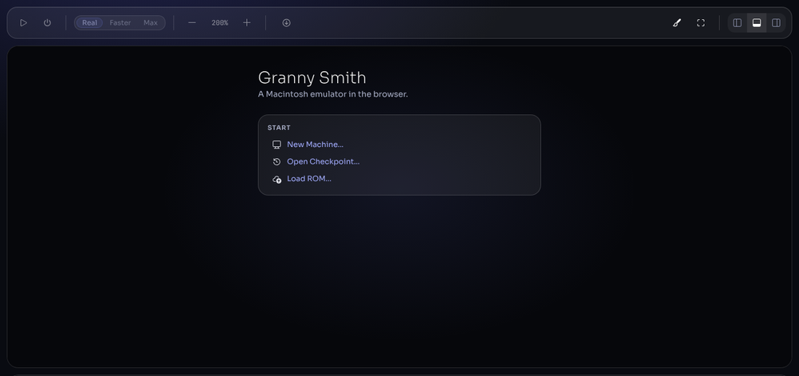
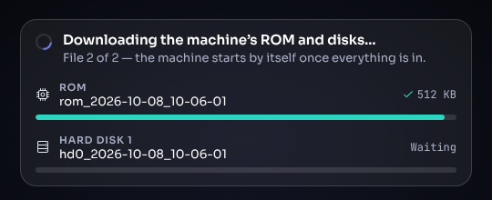

# Getting started

This page takes you from an empty browser to a running Macintosh, then
points you at the rest of the documentation.

## 1. What you need

1. **A Chromium-based browser** — Google Chrome, Microsoft Edge, Brave and
   similar. Firefox works partially; Safari currently has rendering and
   audio problems and is not supported. The browser needs WebGL 2 (hardware
   acceleration turned on) and must allow the site to store data — private
   or incognito windows may refuse it.
2. **A ROM image** for the machine you want to emulate. The ROM is the
   firmware chip of the real computer; Granny Smith does not include any
   Apple ROMs. [Supported machines](machines.md) lists every ROM it
   recognises. A ROM file is identified by its contents, so its name does
   not matter.
3. **System software** on a disk image: a startup floppy, a hard-disk image
   with a System Folder, or an installer CD. Raw images (`.img`, `.dsk`,
   `.hda`, `.iso`), Disk Copy images and `.dmg` files all work, and so do
   disks inside `.zip`, `.sit` and similar archives — see
   [Disks and images](disks-and-images.md).

Everything you load is kept in the browser's private storage for this site
(the *Origin Private File System*, shown inside the emulator as `/opfs`), so
you load each file only once.

## 2. The first visit

1. Open the emulator page. On the very first visit the page may reload
   itself once: it installs a small helper that enables the multi-threaded
   features the emulator needs.
2. A *preview build* notice may appear. Read it and click **Continue**; it
   does not come back.
3. You are on the **Home** screen, with three actions under **START**:
   **New Machine...**, **Open Checkpoint...** and **Load ROM...**.



## 3. Your first machine

Pick whichever of the three routes suits you.

### 3.1 Load a ROM, then create a machine

1. Click **Load ROM...** and choose one or more ROM files. A notice
   confirms each one (for several files, a summary such as
   "32 stored (6 video ROMs, 22 ROMs, …)").
2. Click **New Machine...**.
3. Choose the **Model**. Only models whose ROM you have loaded are listed.
4. Under **Floppy drives** or **Storage**, open the drive's menu and choose
   **Load image...** to pick a startup disk from your computer (or one you
   loaded earlier).
5. Click **Start**.

[Creating a machine](new-machine.md) explains every option in the dialog.

### 3.2 Drag and drop

1. Drag a ROM file onto the emulator window. With no machine running, it
   boots the first model that ROM supports.
2. Drag a floppy image onto the running machine: it goes into the first
   empty floppy drive. A CD image goes into the CD-ROM drive.

### 3.3 Open a link

A link can carry the ROM and disks itself, so the machine starts without
any dialog:

```
https://<emulator page>/?rom=https://example.com/roms/MacIIci.rom&hd0=https://example.com/disks/System7.img
```

The page downloads each file, stores it, and boots. Every option of the New
Machine dialog can be given this way — see [URL parameters](url-parameters.md).



## 4. The screen at a glance


- **Toolbar** (top): run/pause, shut down, speed (**Real**, **Faster**,
  **Max**), zoom, **Save State**, appearance, screen mode, panel position.
- **Display** (middle): the Mac's screen. Click it to give the Mac your
  mouse and keyboard; press **Esc** to take them back.
- **Panel** (bottom by default): **Terminal**, **System**, **Filesystem**,
  **Images**, **Checkpoints**, **Debug** and **Logs**.
- **Status bar** (bottom): machine state, speed, drive activity lights, and
  the model and memory size.

[The interface](interface.md) describes each part in detail, and
[Mouse and keyboard](mouse-and-keyboard.md) the key map.

## 5. Coming back later

Granny Smith saves the running machine in the background every few
seconds. When you reload the page or come back later, it asks **Continue
from saved checkpoint?** — choose **Resume** to carry on exactly where you
left off. Machines you started recently are also listed under **RECENT** on
the Home screen. See [Saving and resuming](saving-and-resuming.md).

## 6. Where next

- Which system software runs on which model: [Supported machines](machines.md).
- Moving files in and out of the Mac: [Sharing files with the Mac](sharing-files.md).
- Something does not work: [Troubleshooting](troubleshooting.md).
