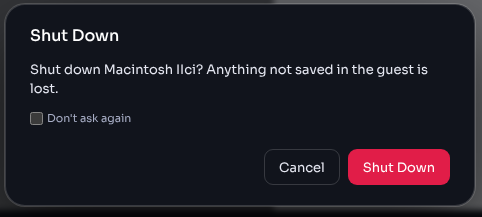
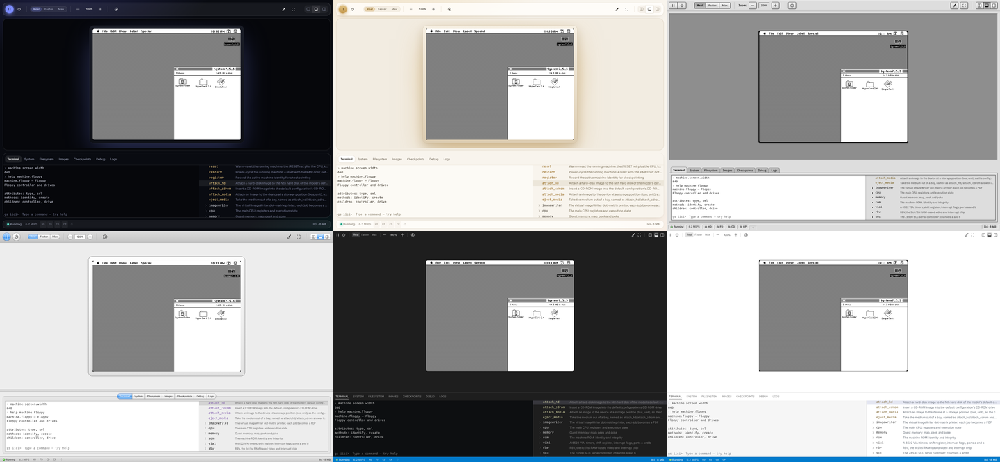
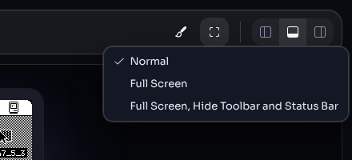
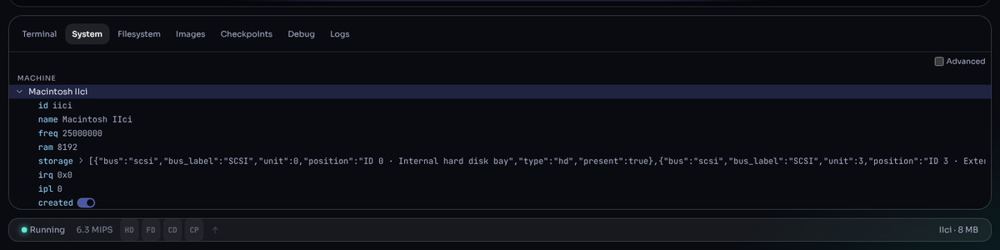

# The interface

The emulator window has four parts: the **toolbar** at the top, the
**display** with the Mac's screen, a **panel** of tools (at the bottom by
default), and the **status bar** along the bottom edge.

## 1. Toolbar

From left to right:

| Control | What it does |
|---|---|
| **Run** / **Pause** | Pause the machine, or let it run again. A paused machine keeps its state; the Debug panel can inspect it. |
| **Shut down** | Turn the machine off and return to the Home screen. A dialog asks first ("Anything not saved in the guest is lost"); tick **Don't ask again** to skip it in future. |
| **Real · Faster · Max** | The speed mode — see §2. |
| **Zoom out**, zoom level, **Zoom in** | Scale the screen, from 100 % to 300 % in steps of 10 %. You can also type a value into the zoom field. Until you choose a zoom, the screen is fitted to the display area (up to 200 %). |
| **Save State** | Download the whole machine — memory, devices and disks — as one file you can open again later. See [Saving and resuming](saving-and-resuming.md). |
| Camera, microphone | Shown only on machines with video and sound inputs (the AV Quadras). See [Sound, camera and 3D](sound-and-video.md). |
| **Appearance** | Choose the look of the emulator (§5). |
| **Screen Mode** | **Normal**, **Full Screen**, or **Full Screen, Hide Toolbar and Status Bar** (§6). |
| **Panel Left · Panel Bottom · Panel Right** | Where the tool panel sits. |

The speed and zoom controls are active only while a machine is running.

## 2. Speed modes

| Mode | Behaviour |
|---|---|
| **Real** | Runs at the original Mac's speed. |
| **Faster** | Runs the processor faster while keeping games, sound and animations at the correct speed — like adding a CPU accelerator card. The status bar shows the factor (1.5× … 8×). |
| **Max** | Runs everything as fast as possible to skip ahead; games and sound run fast too. Useful for long installs and boots. |

The mode applies to every machine you run in this page; a link can preset
it with `speed=` ([URL parameters](url-parameters.md) §4).

## 3. Display

- The Mac's screen is fitted to the display area — as large as fits, up to
  200 % — until you choose a zoom yourself. A screen larger than the area
  even at 100 % scrolls; or use full screen.
- **Click the screen** to give the Mac the mouse and keyboard; press
  **Esc** to get them back. See [Mouse and keyboard](mouse-and-keyboard.md).
- **Drop files** onto the display: a ROM boots a machine (when none is
  running), a floppy goes into the next empty floppy drive, a CD into the
  CD-ROM drive, and a saved-state file restores that machine. "Drop to
  open" is shown while you drag.
- The Home screen and the New Machine dialog appear here when no machine
  is running.

## 4. Status bar

| Item | Meaning |
|---|---|
| State | **Running**, **Paused**, **Stopped** or **Crashed**. |
| Speed | In Faster mode, the speed factor (for example **3×**). |
| MIPS | Emulated instructions per second, in millions. |
| **HD**, **FD**, **CD** | Hard disk, floppy and CD-ROM activity lights; shown only for drives the machine has. |
| **CP** | Flashes on each automatic checkpoint (every ~15 seconds); hover to see when the last one was taken. |
| **Caps Lock** (⇪) | The Mac's Caps Lock key. It follows your keyboard's Caps Lock; click it to latch Caps Lock on a keyboard without one. |
| Printer | While printing, the job and page; afterwards a button that reopens the last printed document. |
| Activity | Long operations (downloads, imports) with their progress, and a **×** to cancel when possible. |
| Model · memory | The running model and its RAM, at the right. |

## 5. Appearance

**Appearance** offers six looks: **Midnight** (the default), **Starlight**,
**Platinum**, **Aqua**, **Workbench** and **Workbench Light**. The choice
is remembered.

## 6. Full screen

1. Choose **Screen Mode → Full Screen** to fill the monitor with the
   emulator, or **Full Screen, Hide Toolbar and Status Bar** to show only
   the Mac.
2. Press **Esc** (or choose **Normal**) to leave. If the Mac has the mouse,
   the first Esc releases the mouse and the second leaves full screen.

## 7. Panels

The tool panel has seven tabs. Drag the edge between the panel and the
display to resize it.

| Tab | Use it to | Details |
|---|---|---|
| **Terminal** | Type commands: inspect and control the machine, manage files | [The terminal](terminal.md) |
| **System** | Browse every setting and status value of the machine and emulator as a tree; change writable ones | §7.1 |
| **Filesystem** | Browse the browser storage (`/opfs`), look inside disk images and archives, import and export files | [Disks and images](disks-and-images.md) §5 |
| **Images** | Your stored ROMs and disk images by kind; insert, eject, rename, download, delete | [Disks and images](disks-and-images.md) §4 |
| **Checkpoints** | Saved machines: create, load, rename, delete | [Saving and resuming](saving-and-resuming.md) |
| **Debug** | Pause, step, breakpoints, registers, memory | [Debugger and logs](debugger.md) |
| **Logs** | Emulator log messages by category | [Debugger and logs](debugger.md) §4 |

### 7.1 System

- **MACHINE** lists the running machine's components (processor, memory,
  screen, drives, serial ports, …); **EMULATOR** the emulator's own
  settings (scheduler, checkpoints, files, logs, AppleTalk, …).
- Expand a row with its arrow (or the arrow keys); press **Enter** or
  **F2** to edit or toggle the selected value. Read-only values cannot be
  edited.
- Right-click a row to **Copy path** or **Copy value**. The path is what
  you type in the [terminal](terminal.md) to reach the same value.
- Tick **Advanced** to show more detail.
