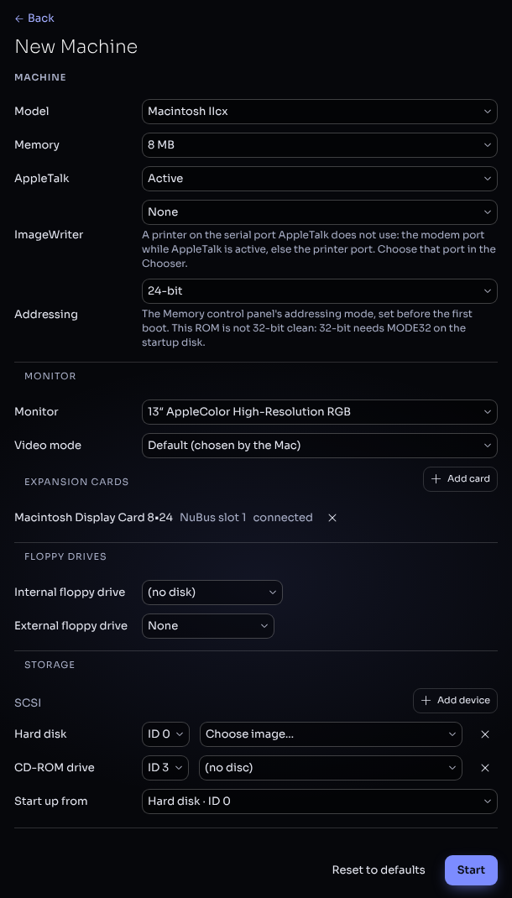
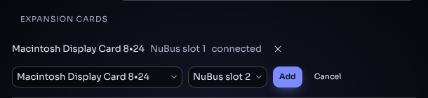
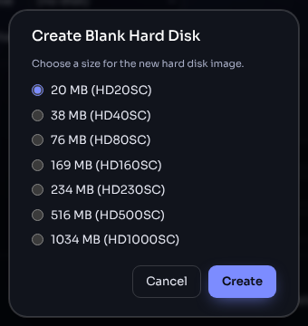

# Creating a machine

The **New Machine** dialog builds a machine to your specification: model,
memory, monitor, expansion cards, drives and the disks in them. Open it
with **New Machine...** on the Home screen. If a machine is running, shut
it down first (the power button in the toolbar).

The dialog shows only what the chosen model has: a Plus has no Addressing
or Expansion Cards sections, a Lisa has a ProFile port instead of SCSI,
and so on. [Supported machines](machines.md) lists what each model offers.

## 1. Machine

1. **Model** — every model whose ROM you have loaded. If the list is empty
   ("No ROMs in storage"), go **Back** and use **Load ROM...** first.
2. **Memory** — the RAM installed. The default is a typical configuration
   for the model.
3. **AppleTalk** — **Active** (default) connects the Mac to Granny Smith's
   simulated AppleTalk network, with a file server and a LaserWriter (see
   [Sharing files](sharing-files.md) and [Printing](printing.md)).
   **Inactive** leaves the Mac's printer port free for a serial printer.
4. **ImageWriter** — **None**, **ImageWriter** or **ImageWriter II**. The
   printer is connected to the serial port AppleTalk does not use: the
   modem port while AppleTalk is active, else the printer port. Choose that
   port in the Chooser. On a Lisa it is Serial A.
5. **Addressing** (68K Macs with a choice) — **24-bit** or **32-bit**, the
   Memory control panel's setting before the first boot. System 6 needs
   24-bit; Mac OS 7.6 and later need 32-bit. When the ROM is not 32-bit
   clean (SE/30, IIx, IIcx), the dialog says that 32-bit needs MODE32 on
   the startup disk.
6. Model-specific options, such as the Network Server's **keyswitch** and
   **power supplies**.

## 2. Monitor

1. **Monitor** — the display connected to the built-in video (or to the
   display card marked *connected*). Machines with a built-in screen show
   it here without a choice.
2. **Video mode** — **Default (chosen by the Mac)** lets the Mac pick, as
   a new Mac would; or choose a resolution and colour depth to start in.

## 3. Expansion cards

Machines with NuBus or PCI slots list their cards, each with its slot and
whether the monitor is plugged into it (**connected** / **no monitor**).

1. Click **Add card**, choose the card and the slot, and click **Add**.
2. Remove a card with its **×**.

NuBus cards: Macintosh Display Card 8•24, 24AC and 8•24 GC. PCI cards:
the Apple Accelerated PCI Graphics Card and the 3dfx Voodoo2. A card
marked *substitute* runs on Granny Smith's own declaration ROM because you
have not loaded Apple's; load the card's ROM with **Load ROM...** to use
the original. A card marked *unavailable* needs a ROM that has not been
loaded.

## 4. Floppy drives

Each drive has a menu:

- **(no disk)** — leave it empty.
- A disk you have loaded before.
- **Load image...** — pick a floppy image from your computer; it is stored
  and selected.
- **Create blank image...** — a new, empty 800K or 1.4 MB floppy.

Where the model allows a second drive, its type menu offers **None** or
the drive type (for example **SuperDrive (1.4 MB)**, or an **800K drive**
on the Plus).

## 5. Storage

1. Each bus (SCSI, ATA, or the Lisa's ProFile port) lists its devices. A
   hard disk and a CD-ROM drive have an **ID** menu and a media menu; the
   **×** removes the device, and **Add device** adds another.
2. The hard disk's menu offers the disks you have stored, **Load image...**
   and **Create blank image...**. A blank hard disk is made at the size of
   a real Apple drive (from 20 MB, HD20SC, up to 1 GB, HD1000SC) and is
   unformatted, like a new drive: initialise it from the installer or with
   Apple HD SC Setup / Drive Setup.

   

3. The CD-ROM drive's menu offers your stored CD images and
   **Load image...**.
4. **Start up from** — the disk the Mac starts from (it sets the Startup
   Disk control panel), or **No default (search all drives)**. A startup
   floppy in the internal drive is always tried first, as on a real Mac.

## 6. Start

- **Start** builds and starts the machine. The status bar then shows the
  model and memory size.
- **Reset to defaults** returns every option to the model's default.
- **Back** returns to the Home screen without starting anything.

The machine you start is added to **RECENT** on the Home screen; click it
there next time to boot the same configuration again.

## 7. The same thing as a link

Everything in this dialog can also be written into the page's address, so
a link starts a ready-made machine: `model=`, `memory=`, `addressing=`,
`monitor=`, `mode=`, the media slots and more. See
[URL parameters](url-parameters.md).
