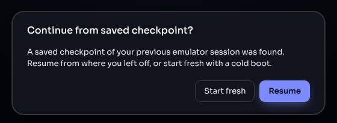
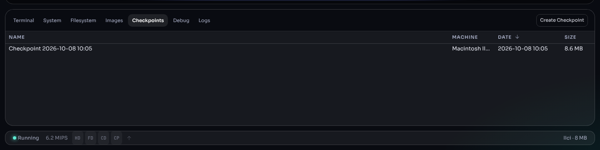

# Saving and resuming

A Granny Smith machine can be put away and picked up later exactly where
it was — memory, screen, open windows, disk contents and all. This happens
automatically, and you can also save a machine to a file.

## 1. Automatic checkpoints

While a machine runs, the emulator saves its complete state in the
background about every 15 seconds, and again when you switch to another
browser tab. The **CP** light in the status bar flashes each time; hover
over it to see when the last one was taken.

A checkpoint holds the machine's memory and devices, and the changes the
Mac has made to its disks. It is stored in the browser, in
`/opfs/checkpoints/`.

## 2. Coming back: Resume

When you open or reload the emulator page and a saved machine exists, it
asks:

- **Resume** — the machine continues from its last checkpoint, as if it had
  never stopped.
- **Start fresh** — the checkpoint is discarded and you get the Home
  screen.

A page opened from a link with a `rom=` parameter boots that link's
machine instead and does not ask.

## 3. Recent machines

The Home screen lists up to eight machines you have started, under
**RECENT**, with their model, memory and disks. Click one to start a *new*
machine with the same configuration and disks (from the disks as stored,
not with the old machine's changes). A disk that has since been deleted is
marked *missing*. The **×** removes an entry.

## 4. The Checkpoints panel

The **Checkpoints** tab lists the saved machines in this browser, with
name, machine, date and size (click a column heading to sort).

- **Create Checkpoint** (top right) saves the running machine now.
- **Double-click** a checkpoint, or right-click → **Load**, to restore it.
- Right-click → **Rename** to give it a meaningful name, or **Delete** to
  remove it.
- Right-click → **Save to computer…** is not available yet; use
  **Save State** (below) to get a file.

## 5. Saving a machine to a file

To keep a machine outside the browser — as a backup, to move it to another
computer, or to share it:

1. Click **Save State** in the toolbar (the download arrow).
2. The browser downloads `saved-state-<date>-<time>.bin`. It is
   self-contained: it includes the machine's disks in full, so it can be
   large (a Power Mac with a 500 MB disk makes a file of a few hundred MB).

To restore it:

1. Shut down any running machine (toolbar power button).
2. On the Home screen, click **Open Checkpoint...** and choose the file —
   or drop the file onto the display.
3. The machine continues where it was saved. A file that is not a Granny
   Smith checkpoint is refused with a message saying so.

## 6. What is kept, and for how long

- **Kept between visits:** stored ROMs and images, checkpoints, the shared
  folder — everything under `/opfs` — plus your preferences (appearance,
  panel layout, zoom, recent machines).
- **Lost** when you clear the site's data in the browser settings, or in a
  private window when it closes.
- **Checkpoints belong to one version of the emulator.** A checkpoint or
  saved-state file can only be restored by the same build that made it
  (the build date is the first line in the terminal). After the emulator
  page is updated, older checkpoints cannot be resumed — the machine has to
  be started again from its disks. Keep anything important on a disk image
  or in the shared folder, not only in a checkpoint.
