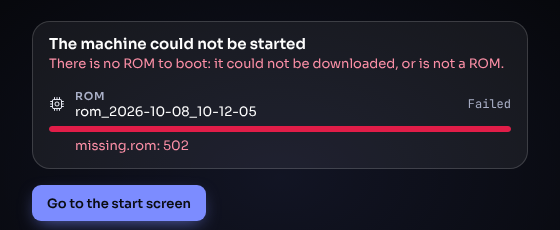

# URL parameters

A link to the emulator page can carry a whole machine: its ROM, its disks
and its configuration. Opening such a link downloads the files, stores them
in the browser, and boots the machine straight away — no Home screen, no
dialog, no questions. Use links to share a ready-made machine, or to
bookmark one you use often.

All URLs below are examples of the *form* a link takes; `example.com`
stands for wherever your files are hosted.

## 1. A first example

```
https://<emulator page>/?rom=https://example.com/roms/MacIIci.rom&hd0=https://example.com/disks/System753.img
```

1. The page downloads the ROM, identifies it (a Macintosh IIci ROM), and
   picks the model.
2. It downloads the hard-disk image, stores it, and attaches it as the
   startup disk.
3. The machine starts. While files download, the screen shows one row per
   file with its progress.


## 2. Media

| Parameter | What it does |
|---|---|
| `rom=<url>` | The machine's ROM. Required: a link without `rom=` opens the Home screen. |
| `rom=<url>&rom=<url>` | A ROM dumped as two chip halves (the Lisa's and the Macintosh XL's boot ROMs). Order does not matter; the page tries both and keeps the one whose checksum is correct. |
| `fd0=<url>`, `fd1=<url>` | Floppy for the first or second floppy drive (when the model has that drive). |
| `hd0=<url>`, `hd1=<url>`, … | Hard disk for the model's first, second, … hard-disk position. `hd0` is the startup disk — on SCSI, IDE or the Lisa's ProFile alike. |
| `cd=<url>` | CD image for the CD-ROM drive, on a model that has one. |
| `vrom=<url>` | A display card's declaration ROM, used for this boot ahead of any other stored revision (SE/30, IIcx, IIfx and other NuBus machines). |

Short forms: `hd=` means `hd0=`, `fd=` means `fd0=`. Parameter names are
not case-sensitive (`ROM=`, `Rom=` and `rom=` are the same); if a name is
given twice, the first one counts (except `rom=`, above).

### 2.1 Blank disks

Instead of a URL, a hard-disk or floppy slot can take `blank:` and a size,
which creates a new, empty disk — for example an empty drive to install
system software on:

```
?rom=…&cd=https://example.com/cds/System75.iso&hd0=blank:HD230SC   an Apple HD230SC (230 MB) drive
?rom=…&fd0=https://example.com/disks/Install1.dsk&hd0=blank:80mb  80 MB, rounded up to an Apple drive size (HD80SC)
?rom=…&hd0=blank:100m                                         exactly 100 MiB, no particular drive model
?rom=…&fd1=blank:800k                                         a blank 800K floppy (or 1440k)
```

- A hard disk takes an Apple drive model (`HD20SC` … `HD1000SC`), a size in
  MB or GB rounded up to the next model (`40mb`, `1gb`), or an exact size
  (`100m`, `512k`), up to 2 GB. On a Lisa: `blank:5mb` or `blank:10mb`
  (ProFile and Widget sizes).
- The disk is unformatted, like a new drive: initialise it from the
  installer or with the disk setup utility.
- Reloading the same link attaches the *same* blank disk again rather than
  making another; `blank!:` instead of `blank:` replaces it with a fresh
  one.
- An impossible size is reported, and the machine boots without that disk.

### 2.2 Files inside archives

A value may point into a `.zip`, `.sit`, `.sea`, `.cpt`, `.hqx` or `.bin`
archive by continuing the path after the archive's name:

```
rom=https://example.com/files/roms.zip/Mac%20IIci/iici.rom
fd1=https://example.com/files/Games.sit/Dark%20Castle.img
```

The archive is downloaded whole and the named member taken out (matched
exactly, then ignoring case, then by a unique base name). An archive named
with no member gives its first suitable file. Compressed `.gz` files and
zip members are unpacked as they download.

## 3. Configuration

Every option of the [New Machine dialog](new-machine.md) can be set by
name. The value may be the option's id or its label, ignoring case and
spaces.

| Parameter | Example | Meaning |
|---|---|---|
| `model=` | `model=q900` | Which model to boot when the ROM serves several (here the Quadra 900 rather than the 700). Ids are in [Supported machines](machines.md). |
| `memory=` (or `ram=`) | `memory=32MB`, `memory=32768` | RAM size (MB with a unit, or KB as a number). |
| `addressing=` | `addressing=32` | 24- or 32-bit addressing on 68K Macs that have the choice. Use `32` for Mac OS 7.6 and later, `24` for System 6 – 7.5. |
| `appletalk=` | `appletalk=inactive` | Connect to the simulated AppleTalk network or not. |
| `imagewriter=` | `imagewriter=imagewriter2` | Attach an ImageWriter (`imagewriter`, `imagewriter2`) or not (`none`). |
| `monitor=` | `monitor=21in_rgb` | The monitor (`13in_rgb`, `12in_rgb`, `15in_portrait`, `21in_rgb`, …). |
| `mode=` | `mode=1152x870x8` | Startup video mode: width × height × bits per pixel; `1152x870` alone picks the deepest mode at that size. |
| `display=` | `display=nubus_9` | Which display device the monitor is plugged into, on a machine with several. |
| model options | `keyswitch=service`, `power_supplies=two` | Any other option the model has. |
| `config=` | `config=<…>` | A complete configuration, as the dialog holds it (base64url-encoded JSON). The other options then edit it. |

A value the model does not offer is shown in a notice and left out — the
machine boots without that change. An option the model does not have at
all (`addressing=` on a Plus) is ignored.

Example — a Macintosh IIfx with 16 MB, in 32-bit mode from the first
instruction, on a 21″ monitor at 1152 × 870 in 256 colours:

```
?rom=https://example.com/roms/MacIIfx.rom&vrom=https://example.com/roms/824-card.rom&hd0=https://example.com/disks/MacOS81.img&memory=16MB&addressing=32&monitor=21in_rgb&mode=1152x870x8
```

## 4. Page settings

| Parameter | Values | Meaning |
|---|---|---|
| `speed=` | `paced`, `accelerated`, `turbo` | Start in **Real**, **Faster** or **Max** speed (see [The interface](interface.md) §2). |
| `skin=` | `midnight`, `starlight`, `platinum`, `aqua`, `workbench`, `workbench-light` | Show this visit in another appearance. Not saved; an unknown name is ignored. |

## 5. Writing links that work

### 5.1 Encoding

Browsers let `:` and `/` through as they are, so most hand-typed links
work. Encode a value (as JavaScript's `encodeURIComponent` does) when it
contains:

- `&` — it would end the value (write `%26`);
- `#` — it would end the address (`%23`);
- `+` — it would become a space (`%2B`);
- `%` — it would start an escape (`%25`);
- a `?` query string of its own — encode the whole value.

Spaces can be typed or written `%20`.

### 5.2 Where the files can live

The page fetches each URL exactly as written, from your browser. The
server must therefore allow other sites to read the file — it must send
*CORS* headers (`Access-Control-Allow-Origin`). Many file hosts do not; a
link to such a host fails with a network or CORS error in the progress
view. A page served over `https://` also cannot fetch `http://` files: such
a value is refused before downloading, with a message saying so.

Files are always downloaded whole, so a large disk takes as long as its
size (a 2 GB disk is several minutes on a fast connection).

### 5.3 What is stored, and what happens on reload

- Each file is stored in the browser, named after its slot and the time it
  was fetched (`hd0_2026-10-04_17-42-05`); a ROM is stored under its
  checksum. You will find them in the Images panel.
- Hard disks and CDs are stored compressed (`.dmg`) and remember the URL
  they came from. Opening a link again with the same `hd0=`/`cd=` value
  reuses the stored copy ("Already stored") instead of downloading it
  again. Floppies and ROMs are downloaded every time.
- The stored disk is never changed by the Mac: what the Mac writes is kept
  with the running machine. Reopening the link therefore starts from the
  original disk again. To continue a machine you started from a link, use
  **Resume** or the Home screen (see [Saving and resuming](saving-and-resuming.md)).

### 5.4 When something fails

- **The ROM** cannot be downloaded or is not a ROM: the page says "The
  machine could not be started", shows the reason under the file, and
  offers **Go to the start screen**.

  

- **A disk** cannot be downloaded or is not valid for its slot (an 800K
  floppy image given as `hd0=`): a notice gives the reason and the machine
  boots without it.
